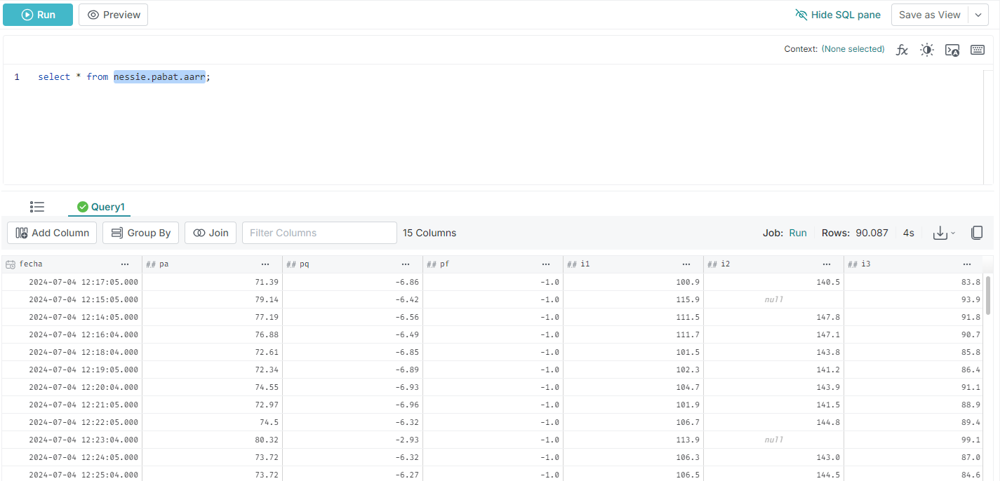

# Datalake: PySpark Iceberg

## Info
* https://blog.iceberglakehouse.com/hands-on-with-apache-iceberg-on-your-laptop-deep-dive-with-apache-spark-nessie-minio-dremio-22840a72a705

## 0. Servicios

| Servicio | Descripcion | url |
| ------------- |:-------------:| :-----:|
| spark-master | spark | [spark cluster](http://localhost:8080) |
| Nessie | Nessie | [nessie](http://localhost:19120) |
| Minio | S3 | [minio](http://localhost:9091) |
| Dremio | Apache Dremio | [dremio](http://localhost:9047) |
| PostgreSQL | PostgreSQL |  |

> [!WARNING]
> Por defecto se crean 4 buckets en Minio

## 1. Spark

Consultar la IP de minio:
```
docker inspect minio
```

Instalar librerias python necesarias:
```
docker exec -it spark pip install py4j boto3 polars-lts-cpu dremio_simple_query
```

Consultar datos de Postgres:
```
docker exec -it spark python3 /opt/spark-apps/postgres.py
```

Ejecutar pipeline de Postgres a Iceberg:
```
docker exec -it spark python3 /opt/spark-apps/postgres2nessie.py
```

Consultar datos de la tabla Iceberg:
```
docker exec -it spark python3 /opt/spark-apps/nessie.py
```

## 2. Dremio

### 2.1 Configurar Dremio

General settings tab
* Source Name: nessie
* Nessie Endpoint URL: http://nessie:19120/api/v2
* Auth Type: None

Storage settings tab
* AWS Root Path: warehouse
* AWS Access Key: admin
* AWS Secret Key: password
* Uncheck “Encrypt Connection” Box (since we aren’t using SSL)
* Connection Properties

| Key | Value |
| ------------- |:-------------:|
| fs.s3a.path.style.access | true |
| fs.s3a.endpoint | minio:9000 |
| dremio.s3.compat | true |

### 2.2 Consultar datos desde dremio



### 2.3 Consultar datos desde python

Ejecutar los ficheros python:
```
docker exec -it spark python3 /opt/spark-apps/dremio.py
```
